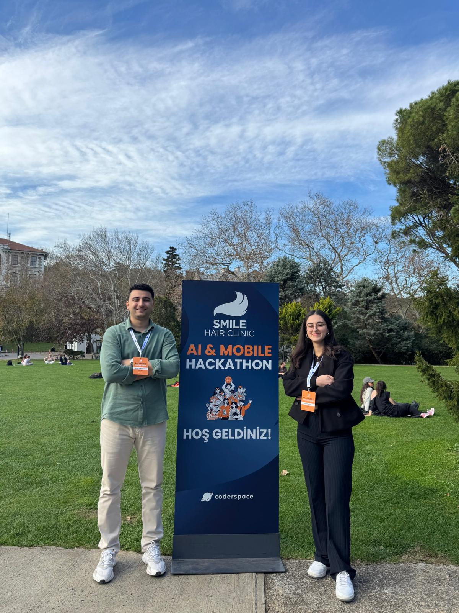

# 🎬 Smile Hair Clinic – AI Powered Video Generation  
### 🏆 2nd Place – Smile Hair Clinic AI & Mobile Hackathon

Bu repo, **Smile Hair Clinic AI & Mobile Hackathon** kapsamında geliştirdiğimiz ve **2.lik ödülü** kazanan *AI Powered Video Generation* projemizin üretim sürecini ve çıktılarını içerir.

Bu proje, saç dökülmesinin sadece fiziksel bir değişim değil, aynı zamanda birçok kişi için **evrensel bir psikolojik yük** olduğunu vurgulayan bir hikâyeyi yapay zeka ile birleştirir.  
Yapay zekayı bir amaç olarak değil, **hikâyeyi güçlendiren bir araç** olarak konumlandırdık.

## 🚀 Proje Amacı  
Bu projenin amacı, AI teknolojilerini kullanarak **duygusal yoğunluğu olan**, tutarlı, sinematik bir kısa video üretmek ve izleyiciye saç dökülmesinin psikolojik etkilerini empatik bir dille aktarmaktı.

## 🛠 Kullanılan Teknolojiler

| Teknoloji / Araç | Kullanım Alanı |
|------------------|----------------|
| **ChatGPT** | Hikâye tasarımı, karakter psikolojisi, senaryo üretimi |
| **Gemini Veo** | Fotogerçekçi ve tutarlı video sahneleri üretme |
| **LTX Studio** | Video birleştirme, sahne geçişleri |
| **CapCut** | Son kurgu, renk düzeltme, ses tasarımı |

## 📖 Proje Hikâyesi – Kısa Özet  
Saç dökülmesi yaşayan üç karakterin, toplum baskısı ve özgüven kaybı arasında sıkışmış içsel yolculuklarını anlatan bir kurgu oluşturduk. Hikâye 3 bölümden oluşuyor:

1. **Gizleme** – karakterin değişimi fark edişi ve çaresizlik hissi  
2. **Yüzleşme** – toplum bakışları, iç monologlar  
3. **Dönüşüm** – kabulleniş, çözüm arayışı ve özgüven kazanımı  

Her sahne, yapay zeka ile tutarlı ifadeler, renk tonları ve ortam atmosferleri düşünülerek üretildi.

## 🎥 Final Video  
👉 https://www.youtube.com/watch?v=KEupKXHDV6M

## 👥 Ekip

- **İrem Dilşat Köse**
- **Burak Talha Memiş**  
  *(https://github.com/Buraktalhaa)*

## 🙏 Teşekkür

Bu deneyimi mümkün kılanlara teşekkür ederiz:

- **Smile Hair Clinic ekibi**
- **Kurucular:** Dr. Mehmet Erdoğan & Dr. Gökhan Vayni
- **Değerli jüri üyeleri**
- **Organizasyon desteği için:** Coderspace
